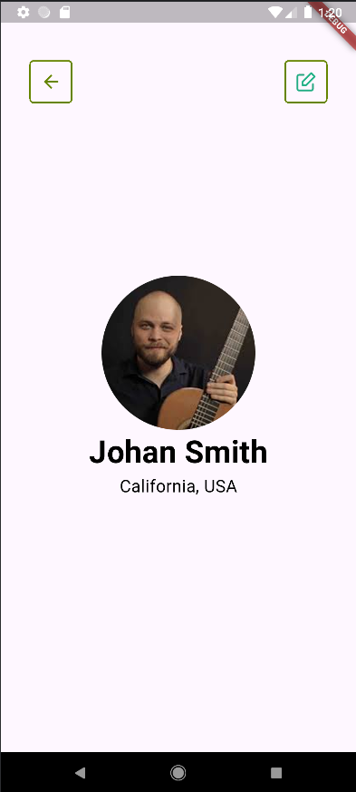

# 083205004013_NguyenHoHoangPhuc_Baitap1
## câu 1:   
### Sau khi học xong môn học tôi muốn:  
    - Tạo ra một phần mềm di động.  
    - Tìm hiểu xem lĩnh vực này có phù hợp với bản thân hay không.    

## câu 2: 
### Trong tương lai 10 năm tới lập trình di động có tiềm lực phát triển do sự ảnh hưởng của điện thoại di động này càng lớn đối với đời sống con người.  
  
## câu 3:  
### Mô tả:  
    - Các nút trong ứng dụng được thể hiện thông qua hàm OutlinedButton.styleFrom.  
    - Hình ảnh được chèn vào thông qua Image.asset.  
    - Phần text thì từ Text.  
    - Gộp phần hình và text lại trong Colum và hàm mainAxisSize: MainAxisSize.min để giới hạn và căn giữa bằng Centre.  
    - Điều chỉnh vị trí nút bằng Positioned.  
        + Chọn vị trí thông qua tỷ lệ màn hình lấy dữ liệu từ BuildContext context.  
### Ảnh demo ứng dụng: 
